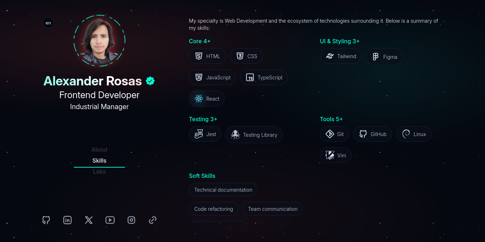

# Personal Portfolio


A modern, responsive, and multilingual portfolio built with **React, Vite, and Tailwind CSS**.  
Designed to showcase my experience as an Industrial Administrator expanding into Software Engineering.

🔗 [Live Demo](https://aleroses.github.io/)  
📁 [Repository](https://github.com/aleroses/aleroses.github.io)



---

## About the Project

This portfolio was built with a strong focus on:

- Clean and scalable architecture
- Reusable components
- Performance and responsiveness
- UI/UX consistency
- Multilingual mode support

The project reflects both my technical growth and my transition into software development.

---

## Tech Stack

- **React**
- **Vite**
- **Tailwind CSS**
- **CSS Modules**
- **Context API**
- **Custom Hooks**
- **ESLint + Prettier**

---

## Features

- 🌍 Multi-language support (English / Spanish)
- 🧩 Component-based architecture
- 📱 Fully responsive design
- 🎨 Animated icons and interactive UI elements
- 📊 Structured data rendering from JSON files

---

## Installation

Clone the repository:

```bash
git clone https://github.com/aleroses/aleroses.github.io.git
cd aleroses.github.io
npm install
npm run dev
```
